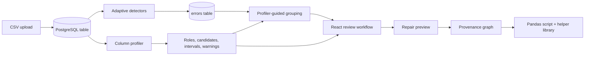

# Buckaroo Profiling and Grouping Architecture

This document describes the implementation currently exercised by the Flask
backend and React UI. It distinguishes production behavior from research-only
experiments so that a reviewer can trace every user-facing claim to code.

## System boundary

Buckaroo stores an uploaded dataset, detector output, provenance state, and
optional human profile corrections. The browser requests summaries and plots;
the backend performs profiling, grouping, repair previews, and export.

## 1. Upload and detector coverage

`app/routes/routes.py` accepts a CSV, creates a stable Buckaroo `ID`, writes the
table through PostgreSQL `COPY`, and records how many rows detectors inspected.
`app/server_utils/dataset_processing_metadata.py` keeps this coverage separate
from the full row count. Error percentages therefore use the detector coverage
as their denominator instead of presenting a sample as a full-data result.

The detector suite is implemented in `detectors/`:

| Module | Responsibility |
| --- | --- |
| `missing_value.py` | Null values and canonical textual missing markers. |
| `datatype_mismatch.py` | Values that disagree with a sufficiently strong dominant physical type. |
| `anomaly.py` | Robust numeric outlier evidence. |
| `incomplete.py` | Suspicious low-frequency categorical values. |
| `common.py` | Shared output format and dataset-adaptive detector configuration. |

Detector defaults remain centralized and caller-overridable. Dataset-level
adaptation is applied before column-level guards, so experiments can disable or
override a decision without editing the detector implementation.

## 2. Column profiling

`profiling/column_profiling.py` measures physical evidence before
assigning meaning:

1. present and missing counts;
2. numeric, datetime, boolean, integer, and text-token evidence;
3. exact or HyperLogLog distinct cardinality;
4. Wilson-style uncertainty intervals;
5. column-name hints; and
6. semantic safeguards for timestamps and geography.

The result is not only a single label. Each profile contains the selected role,
role family and subtype, normalized confidence, alternative candidates,
supporting and conflicting examples, review reasons, data warnings, and a
sampling recommendation.

### Cardinality and key evidence

`detectors/approx_cardinality.py` keeps exact values while cardinality is small
and switches to HyperLogLog after the configured memory bound. HLL uncertainty
is included in the cardinality interval. `detectors/ucc_discovery.py` performs a
bounded, explainable search over likely single columns, pairs, and selected
triples; final candidate validation is exact.

Uniqueness is necessary but not sufficient for a key. A unique timestamp or
coordinate remains a temporal/geographic field unless independent identity
evidence supports a key role.

### Warning versus review

- A **warning** means observed values may be inconsistent or problematic.
- **Needs review** means the data may be valid, but the role is uncertain or
  semantically sensitive.

This distinction is preserved in the API as `dataWarning` versus
`reviewReasons`. Human overrides are stored separately from Buckaroo's original
prediction so evaluation can compare both.

## 3. Profiler-guided semantic-quality grouping

`app/server_utils/multi_view_grouping.py` uses profile roles to decide whether a
column is safe and how it should be represented. It does not collapse raw rows
into one bag of words.

| Profile family | Representation |
| --- | --- |
| Numeric measures | Median/IQR robust-scaled values. |
| Categorical values | Column-aware tokens; optional embeddings only behind explicit gates. |
| Free text | TF-IDF by default; optional SBERT strategy. |
| Temporal fields | Relative time, lifecycle order, and duration evidence. |
| Geography | Unit-sphere coordinates and offline place-name context. |
| Quality | Missingness and detector signals, normalized as a separate block. |
| Identifiers | Excluded from similarity construction. |

Each block preserves source-column identity, is normalized, and enters a
combined semantic-quality representation. Candidate partitions are generated
with deterministic K-means, agglomerative clustering, and adaptive DBSCAN where
feasible. Buckaroo compares repeated-run stability, coherence,
distinctiveness, coverage, semantic specificity, and quality context. The UI
receives only selected, explainable candidates.

Exact duplicate signatures remain a separate advisory path because equality is
not the same research question as semantic similarity.

## 4. Grounded descriptions

Group descriptions are derived from observed contrasts between group rows and
the full sample. A returned group keeps:

- a semantic cohort statement;
- a separate quality pattern;
- supporting fields and their measured contrasts;
- representative examples and contradictory examples;
- stability, coherence, profile confidence, and caveats; and
- stable row IDs used by the selection action.

This prevents a generic description such as "rows in cluster 2" from being
presented as a semantic explanation.

## 5. UI, repair, and provenance

The React UI shows compact column cards and opens a detail inspector for
examples, selected role, confidence, override controls, candidate evidence,
warnings, and review reasons. Review filters are derived from those explicit
states rather than from a single broad uncertainty flag.

Repairs are previewed before promotion. Destructive previews report affected
rows and require confirmation for large deletions. Each accepted operation is
stored as a `Delta` in `app/pgraph/`, making Undo/Redo and export refer to the
same provenance path.

`app/server_utils/pandas_export.py` generates a readable script and ships
`buckaroo_export_helpers.py` beside it. The exported script replays stable row-ID
operations without embedding a second copy of helper code.

## 6. Production and research boundaries

Production modules live under `app/`, `detectors/`, and `ui/src/`. Canonical
research drivers live in `experiments/`. Generated datasets, CSV/JSON results,
workbooks, presentations, screenshots, and timing logs are intentionally
ignored by Git; a merge request must contain the driver and protocol needed to
reproduce them.

The main remaining research limitation is external validity: stability and
detector-grounded metrics are implemented, but semantic usefulness still needs
blinded human ratings across the frozen benchmark described in
`docs/clustering/SEMANTIC_QUALITY_BENCHMARK_PROTOCOL.md`.
