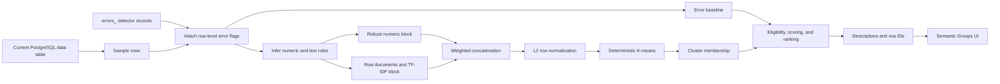

# Current Buckaroo Semantic Row-Grouping Pipeline

> Historical baseline notice, 2026-07-17: this file records the earlier pooled,
> error-conditioned pipeline. The selected UI workflow is now documented in
> `MULTI_VIEW_CLUSTERING_METHODOLOGY.md`. This baseline remains implemented for
> controlled comparisons and compatibility.

## 1. Purpose and scope

This document specifies the current semantic row-grouping implementation in
Buckaroo. It is written as an auditable methods record suitable for conversion
into the Methods and System Design sections of a research paper.

The current system is designed to answer this operational question:

> Which understandable groups of similar rows contain an unusually high
> concentration of errors reported by Buckaroo's detectors?

That is narrower than the general unsupervised-learning question:

> What semantic populations exist in the dataset, whether or not they contain
> detector errors?

The distinction matters. Current feature construction is semantic, but group
filtering, ranking, and UI presentation remain error-conditioned. A pure
semantic mode is future work and must not be described as deployed.

## 2. Terminology and unit of analysis

### 2.1 Object being clustered

The system clusters **dataset rows**. It does not cluster columns.

If a sampled table contains `n` rows, the feature matrix contains `n` matrix
rows. Each matrix row is the numeric representation of one table row.

### 2.2 Feature

A feature is one numeric coordinate supplied to a clustering algorithm. Current
features include:

- robust-scaled values from original numeric columns;
- binary indicators for missing numeric cells; and
- TF-IDF coordinates derived from tokens in text and category columns.

### 2.3 Representation versus clustering algorithm

- TF-IDF and SBERT are **representations**. They convert text into numbers.
- K-means, DBSCAN, HDBSCAN, and agglomerative clustering are **clustering
  algorithms**. They assign rows to groups using numeric representations.
- Exact slicing is a deterministic group-by baseline, not an approximate
  clustering algorithm.

### 2.4 Semantic meaning in this implementation

Production TF-IDF captures lexical and categorical similarity. Rows are similar
when they contain overlapping informative tokens and/or similar numeric values.
It does not provide deep contextual language understanding. For example,
`automobile` and `car` remain different tokens unless both are represented by
other shared evidence.

## 3. System boundary and data flow



The main production entry point is
`generate_semantic_grouping_json()` in
`app/server_utils/semantic_grouping.py`. The HTTP entry point is
`GET /api/plots/semantic-groups` in `app/routes/plot_routes.py`.

## 4. Inputs and database assumptions

### 4.1 Main table

The input is the current Buckaroo PostgreSQL table. The pipeline expects an
`ID` column. Rows with missing or non-numeric IDs are removed from the working
frame after loading.

### 4.2 Detector-error table

Detector output is read from a table named `errors_<tablename>` with this
long-form schema:

| Field | Meaning |
| --- | --- |
| `row_id` | ID of a row in the main table |
| `column_id` | Column associated with the detector record |
| `error_type` | Detector error label |

Only error records whose `row_id` occurs in the sampled rows are loaded.
Failure to read the error table is caught and converted to an empty error table.
This behavior keeps the UI alive, but it can hide database failures unless logs
are inspected.

### 4.3 SQL identifier protection

Table names must match `[a-zA-Z0-9_]+`. Identifiers are also quoted through the
shared SQL utility. This rejects spaces, quotes, semicolons, and other unsafe
identifier characters.

## 5. Current sampling procedure

### 5.1 Production default

The API default is:

```text
sample_rows = 5000
```

The full table size is measured with `COUNT(*)`, but the analyzed sample is
loaded with:

```sql
SELECT * FROM <table> ORDER BY "ID" LIMIT 5000
```

Therefore:

- tables with at most 5,000 rows are analyzed in full;
- larger tables are represented by the first 5,000 rows ordered by `ID`;
- this is deterministic but is not a probability sample; and
- appended, time-ordered, source-ordered, or ID-structured tables can produce
  biased clusters.

The API response distinguishes:

- `requestedSampleRows`: requested cap;
- `sampleRows`: rows remaining after ID cleaning; and
- `totalRows`: full table count.

### 5.2 Frontend Meta sample

The frontend Meta selector explicitly requests 1,500 rows for each candidate.
It does this to keep five concurrent candidate requests responsive.

### 5.3 Current sampling limitations

The production path does not currently:

- randomly sample rows;
- stratify by known class, source, time, or error status;
- record a random seed or sampled-row hash;
- measure sample representativeness;
- compare results across repeated samples; or
- use reservoir sampling for streams.

Consequently, existing UI results are deterministic for a fixed table order,
but not statistically representative by construction.

## 6. Row and error preprocessing

### 6.1 ID cleaning

`ID` values are converted with `pandas.to_numeric(errors="coerce")`. Invalid IDs
become missing, invalid rows are removed, and valid IDs are cast to integers.

### 6.2 Error attachment

Detector records are grouped by `row_id`. Two helper columns are added:

- `_buckaroo_has_error`: whether at least one detector record exists;
- `_buckaroo_error_count`: number of detector records for the row.

The pipeline uses **error rows**, not error-record counts, for its primary rate:

```text
baseline_error_rate = number of sampled rows with >=1 error / sampled rows
```

A row with ten detector records contributes one error row to this rate.

### 6.3 Missing-value semantics

Missingness is determined by the shared detector helper. It includes Pandas
nulls and configured textual markers such as blank strings, `?`, `null`, and
`unknown`. Missingness can become a clustering signal rather than being removed.

This is intentional because patterns such as "salary missing" or "occupation
missing" may define an operationally meaningful subgroup. It also means clusters
can be dominated by data-quality state rather than domain meaning.

## 7. Automatic column-role inference

Helper columns (`ID`, `row_id`, `column_id`, `error_type`, `Unnamed: 0`) and
columns beginning with `_buckaroo_` are excluded.

For each remaining column:

1. Remove values recognized as missing.
2. Attempt numeric parsing.
3. Calculate:

```text
numeric_ratio = parsable non-missing values / non-missing values
distinct_count = distinct string forms among non-missing values
```

4. Assign the column to the numeric block when:

```text
numeric_ratio >= 0.90 AND distinct_count > 3
```

5. Otherwise assign it to the text/category block.

An all-missing column enters the text/category block.

### 7.1 Consequences of this rule

- Numeric identifiers with more than three distinct values are treated as
  numeric measurements unless another layer intervenes.
- Numeric codes with three or fewer values are treated as categories.
- Mixed numeric columns can switch blocks around the 90% threshold.
- Datetimes are not explicitly parsed here and normally enter the text block.
- The role inference is calculated on the current sample, so sampling can alter
  the representation itself.

## 8. Numeric feature construction

For each inferred numeric column:

1. Parse values numerically.
2. Skip the column if fewer than three values parse successfully.
3. Calculate sample median, first quartile, third quartile, and IQR.
4. Use IQR as the scale when nonzero; otherwise use sample standard deviation.
5. Skip the feature when both scales are zero or invalid.
6. Median-impute missing numeric values.
7. Robust-scale each value:

```text
z_robust = (x - median) / scale
```

8. Clip `z_robust` to `[-4, 4]`.
9. Divide by 4, producing a nominal range of `[-1, 1]`.

The final value is therefore:

```text
x_numeric = clip((x - median) / scale, -4, 4) / 4
```

### 8.1 Missingness indicator

If any value in a numeric column is missing, one additional binary feature is
created:

```text
1 = numeric value was missing before median imputation
0 = numeric value was present
```

The reported numeric feature names include both original column names and names
like `salary:missing`.

### 8.2 Numeric weighting

Before concatenation, the entire numeric block is multiplied by `0.75`.
This is a heuristic intended to keep large sets of numeric evidence from
overwhelming lexical/category evidence. The weight is not learned from data and
is not calibrated in production.

## 9. Text and category document construction

Each dataset row becomes one TF-IDF "document." For every inferred text/category
column, the document receives:

1. tokens from the column name;
2. up to 30 tokens from the cell value; or
3. the token `missing` plus a second copy of the column-name tokens when the
   value is missing.

Example:

```text
UndergradMajor = "Web development"
Country = "United States"
```

can contribute:

```text
undergrad, major, web, development, country, united, states
```

### 9.1 Tokenization

Tokenization:

- inserts a boundary between lowercase and uppercase characters, allowing
  `ConvertedSalary` to become `Converted Salary`;
- lowercases text;
- extracts `[a-z0-9]+` sequences;
- removes one-character tokens; and
- removes a fixed English stop-word list.

The tokenizer does not currently perform stemming, lemmatization, spelling
normalization, synonym expansion, phrase detection, or language detection.

### 9.2 Pooling and source-column identity

All text/category columns for a row are pooled into one document. Column-name
tokens provide partial context, but value tokens are not encoded as explicit
column-value pairs.

For example, `India` contributes the token `india`, not `country=india`.
Therefore the representation can lose exact source-column identity when the
same token appears in several columns. This is the precise sense in which the
current method "collapses" text features. It does not collapse numeric columns,
which remain explicit coordinates.

## 10. TF-IDF construction

Let:

- `N` be the number of sampled row documents;
- `c(t,d)` be the count of token `t` in document `d`;
- `|d|` be the total retained token count in document `d`; and
- `df(t)` be the number of documents containing `t`.

### 10.1 Vocabulary filtering

A term is eligible when:

```text
2 <= df(t) <= max(2, floor(0.90 * N))
```

Thus:

- terms appearing in only one sampled row are removed;
- terms appearing in more than 90% of rows are removed; and
- the filter depends on the sampled rows.

Eligible terms are sorted by descending `(document frequency, lexical term)`
and truncated to the first 350 terms. This favors relatively frequent eligible
terms, not the terms with the largest final IDF or mutual information.

### 10.2 Term frequency

```text
tf(t,d) = c(t,d) / |d|
```

### 10.3 Smoothed inverse document frequency

```text
idf(t) = log((1 + N) / (1 + df(t))) + 1
```

### 10.4 TF-IDF value

```text
tfidf(t,d) = tf(t,d) * idf(t)
```

The row-by-term matrix is L2-normalized before it is returned from the TF-IDF
builder.

## 11. Combined feature matrix

Let:

- `p` be the number of usable numeric coordinates, including numeric missingness
  indicators; and
- `q` be the number of retained TF-IDF terms, where `0 <= q <= 350`.

The pre-normalization matrix has shape:

```text
N x (p + q)
```

and is constructed as:

```text
X_raw = [0.75 * X_numeric | X_tfidf]
```

If both blocks are empty, a single all-zero feature is created so downstream
code receives an `N x 1` matrix.

NaN and infinite values are replaced with zero. Each complete row vector is
then L2-normalized:

```text
X_i = X_raw_i / ||X_raw_i||_2
```

Zero vectors retain zero values by using a denominator of one.

### 11.1 Interpretation of distance

Production K-means calculates squared Euclidean distance between normalized row
vectors and normalized centroids. For unit-length vectors `x` and `y`:

```text
||x - y||^2 = 2 - 2 * cosine_similarity(x, y)
```

Therefore nearest-centroid assignment is cosine-like after normalization.
However, the implementation is still K-means with squared Euclidean objectives,
not spherical K-means with an independently documented optimization proof.

## 12. Production clustering algorithm

### 12.1 K selection

When the API does not provide `cluster_count`, production calculates:

```text
k_size  = max(1, floor(N / min_group_size))
k_shape = max(1, round(sqrt(N) / 2))
k       = max(1, min(8, k_size, k_shape))
```

Default `min_group_size` is 12. The requested `k` is then capped by:

- number of rows; and
- number of unique row vectors.

The production heuristic never requests more than eight clusters.

### 12.2 Initialization

The local deterministic K-means implementation uses NumPy random seed 42.

1. Choose the first centroid from a seeded random row.
2. Repeatedly choose the row farthest from its nearest existing centroid.
3. Stop when `k` centroids have been selected.

This is a deterministic farthest-first heuristic with the same motivation as
spread-out initialization. It is not the exact probabilistic k-means++ method.

### 12.3 Assignment and update

For at most 40 iterations:

1. Compute an `N x k` squared-distance matrix.
2. Assign every row to its nearest centroid.
3. Stop when assignments are unchanged.
4. Replace each centroid with the arithmetic mean of its member vectors.
5. If a cluster becomes empty, use the row farthest from any current centroid.
6. L2-normalize centroids.

The vectorized squared-distance formula is:

```text
D = row_norms - 2 * X * C^T + centroid_norms
```

K-means compares rows with centroids. It does **not** construct an all-pairs
`N x N` row-distance matrix.

### 12.4 Approximate computational cost

For `N` rows, `F` features, `k` clusters, and `I` iterations, assignment cost is
approximately:

```text
O(N * F * k * I)
```

The dense production feature matrix requires approximately:

```text
8 * N * F bytes
```

because NumPy float arrays normally use 64-bit values. At the default maximum
of 5,000 rows and roughly 370 features, one dense matrix is approximately
14.8 MB before temporary arrays and Python/Pandas overhead. Meta launches five
requests concurrently, so peak application memory can be materially larger.

## 13. Grouping strategies

### 13.1 `cluster_first` / All Rows

1. Build features for every sampled row.
2. Cluster every sampled row.
3. Calculate detector-error concentration inside each cluster.
4. Retain only clusters satisfying size and error support thresholds.

This provides the strongest comparison between error and non-error rows, but
still returns only error-supported clusters.

### 13.2 `error_first` / Errors

1. Filter the sample to rows with at least one detector error.
2. Build features only for those error rows.
3. Cluster the error rows into diagnostic themes.

Every source row already contains an error, so returned groups normally have an
error rate of 1.0. This mode is useful for organizing known errors, not for
estimating whether a semantic population has elevated risk relative to clean
rows.

### 13.3 `exact_slices` / Slices

Exact slicing enumerates interpretable value groups rather than approximate
vector clusters.

Candidate text/category columns must have between 1 and 80 distinct non-missing
values. Up to four numeric columns are added, prioritized by non-null presence
among error rows.

- Text labels use exact formatted values.
- Numeric values use four quantile bins through `qcut`, with four equal-width
  bins as fallback.
- Every one-column slice is tested.
- Two-column combinations are tested only among the first six candidate
  columns.

The method is interpretable but cannot automatically merge lexical variants
such as `USA` and `United States`.

### 13.4 `auto`

Backend `auto` currently maps directly to `cluster_first`. It is not the same as
the browser Meta selector and does not inspect dataset characteristics.

## 14. Group eligibility and metrics

A cluster is considered for reporting only when:

```text
group_size >= min_group_size
error_rows >= min_error_rows
```

Production defaults are:

```text
min_group_size = 12
min_error_rows = 2
```

For a candidate group `g`:

```text
error_rate(g) = error rows in g / rows in g
baseline_error_rate = all sampled error rows / all sampled rows
lift(g) = error_rate(g) / baseline_error_rate
error_coverage(g) = error rows in g / all sampled error rows
```

The ranking score is:

```text
score(g) = lift(g)
           * log(1 + error_rows(g))
           * (0.5 + error_coverage(g))
```

Interpretation:

- lift rewards groups with error rates above the sample baseline;
- logarithmic support reduces the influence of tiny high-lift groups;
- coverage rewards groups explaining a meaningful share of all error rows.

If the baseline error rate is zero, lift is set to zero. If all rows are errors,
lift cannot exceed one, making error lift uninformative.

### 14.1 Deduplication

After score sorting, groups are compared by Jaccard overlap of returned row IDs:

```text
J(A,B) = |A intersect B| / |A union B|
```

The later group is removed when `J >= 0.95`.

Only the first 2,000 row IDs are stored in each group. For groups larger than
2,000 rows, deduplication therefore operates on truncated row-ID sets and can
misestimate full-group overlap.

### 14.2 Response limit

After sorting and deduplication, production returns at most eight groups by
default.

## 15. Cluster explanation generation

Descriptions combine three evidence sources.

### 15.1 Numeric explanations

For each numeric column:

```text
standardized_difference =
    (group mean - full-sample median) / full-sample scale
```

Scale is IQR, with standard deviation fallback. A column is mentioned only when
the absolute difference is at least 0.45. At most two numeric descriptions are
retained.

### 15.2 Text/category explanations

For each text/category column:

1. Find the modal value in the group.
2. Calculate its group share and full-sample share.
3. Calculate concentration lift as group share divided by global share.
4. Keep the description when group share is at least 35%, and either lift is at
   least 1.2 or group share is at least 75%.

At most three text/category descriptions are retained.

### 15.3 TF-IDF term explanations

The average TF-IDF vector inside the cluster is compared with the global average
TF-IDF vector. Up to five terms with the largest positive difference are
returned. The displayed cluster description uses at most four of them in one
phrase.

### 15.4 Dominant detector issue

For each group, detector type and column are combined as
`error_type:column_id`. The most frequent pair is the main issue. The three most
frequent affected columns are returned separately.

### 15.5 Explanation limit

`featureHighlights` contains at most five highlights. The short description
joins only the first three with semicolons.

## 16. API contract

### 16.1 Request

```text
GET /api/plots/semantic-groups
```

| Query parameter | Default | Meaning |
| --- | ---: | --- |
| `tablename` | current table | Buckaroo table to analyze |
| `strategy` | `auto` | `auto`, `cluster_first`, `error_first`, or `exact_slices` |
| `limit` | 8 | maximum returned groups |
| `sample_rows` | 5000 | maximum rows loaded |
| `cluster_count` | heuristic | optional explicit `k` |
| `min_group_size` | 12 | minimum rows in a returned group |
| `min_error_rows` | 2 | minimum error rows in a returned group |

### 16.2 Response metadata

The backend returns:

- requested and effective strategy;
- similarity tool name and description;
- sampled and total row counts;
- baseline error rate and error-row count;
- inferred numeric and text columns; and
- ranked group records.

Each group contains ID, strategy, label, description, row count, error count,
error rate, baseline rate, lift, score, coverage, dominant issue, dominant error
columns, row IDs, truncation status, and feature highlights.

### 16.3 Error handling

The route returns `success: false` with the exception message when generation
raises. It currently prints the traceback server-side rather than using a
structured experiment/provenance logger.

## 17. Frontend Meta selector

Meta is implemented in the React frontend, not in the backend algorithm module.
It runs these five API candidates concurrently on 1,500 rows:

| Candidate | Strategy | Key parameter |
| --- | --- | --- |
| All Rows k=4 | `cluster_first` | `k=4` |
| All Rows k=8 | `cluster_first` | `k=8` |
| Errors k=4 | `error_first` | `k=4` |
| Errors k=8 | `error_first` | `k=8` |
| Slices | `exact_slices` | no `k` |

All use `limit=8`, `min_group_size=12`, and `min_error_rows=2`.

### 17.1 Meta rejection rules

A candidate is rejected when:

- no groups are returned;
- the top group contains fewer than two error rows; or
- the top group contains at least 90% of sampled rows.

### 17.2 Meta score

For the top five returned groups, the selector calculates mean group score,
mean lift, summed error coverage, top-group dominance, and browser-observed
request duration.

Accepted candidates use this implemented score:

```text
selector_score = mean_top_score
               + 0.25 * top_score
               + 1.4 * max(0, mean_top_lift - 1)
               + 2.0 * min(top5_coverage, 1.5)
               - dominance_penalty
               - low_lift_penalty
               - runtime_penalty
```

where:

```text
dominance_penalty = 1.4 * max(0, top_group_fraction - 0.55)
low_lift_penalty  = 1.2 * max(0, 1.05 - mean_top_lift)
runtime_penalty   = 0.25 * min(duration_ms / 30000, 1.5)
```

The low-lift penalty is disabled when baseline error rate is at least 95%.
Rejected candidates receive `-1000 + mean_top_score`; failed requests receive
`-1,000,000`.

If all successful candidates are rejected, Meta chooses the highest-scoring
successful fallback and marks the selection basis as `fallback`.

### 17.3 Meta methodological limitations

- Candidate requests run concurrently, so duration includes contention.
- Browser duration includes network and backend work and is not pure clustering
  time.
- Candidate durations are used during scoring but are not preserved in the
  compact candidate metadata returned for later audit.
- The score is hand-weighted and has not been calibrated against human semantic
  judgments.
- All terms still optimize error-discovery utility rather than pure semantic
  coherence.

## 18. Runtime measurement status

### 18.1 Production

The production backend does not currently return or persist separate timings for:

- SQL loading;
- detector-error loading;
- role inference;
- numeric feature creation;
- TF-IDF creation;
- clustering;
- description generation; or
- total endpoint time.

Therefore no research-grade production-runtime claim can currently be derived
from the API response alone.

### 18.2 Experiments

Experiment scripts use `time.perf_counter()` and record several boundaries:

- dataset load time;
- detector time;
- feature-construction time; and
- clustering time.

These components do not always include report serialization, process startup,
model download, dependency import, or frontend rendering. Existing artifacts
also do not preserve hardware metadata or repeat counts, so historical timings
are descriptive rather than controlled performance estimates.

## 19. Existing automated verification

`tests/unit/test_semantic_grouping.py` currently verifies:

1. cluster-first finds an elevated semantic error concentration in a 24-row
   synthetic dataset;
2. error-first returns only error rows and therefore group error rate 1.0; and
3. exact slicing returns a readable `product = Student Loan` group.

The tests confirm core behavior, but they do not currently verify:

- database sampling or API validation;
- exact TF-IDF values;
- matrix dimensions and weighting;
- seeded stability under row reordering;
- large-data runtime or memory;
- Meta selection;
- semantic coherence against human labels;
- behavior when there are no detector errors;
- deduplication with truncated row IDs; or
- equivalence across repeated random samples.

## 20. Threats to validity and known limitations

### 20.1 Sampling validity

First-`ID` sampling can underrepresent later table segments. Existing production
results should not be generalized to full tables without checking order effects.

### 20.2 Representation validity

Pooled row documents blur text-column identity, use only lexical overlap, remove
single-occurrence terms, cap vocabulary at 350 terms, and use sample-dependent
role inference. Numeric IDs can be interpreted as quantities.

### 20.3 Objective validity

The group score measures detector-error concentration, support, and coverage.
It is not a measure of semantic coherence, business usefulness, causal relevance,
or ground-truth cluster recovery.

### 20.4 Detector dependence

If detectors flag nearly every row, error lift becomes uninformative. If
detectors miss an important problem, clustering cannot discover that problem
through the error-conditioned score.

### 20.5 Algorithm validity

Production uses one seeded K-means run, a heuristic `k`, a dense matrix, and
hand-set feature weights. No production-level stability estimate or automatic
algorithm selection is currently returned.

### 20.6 Evaluation validity

Most existing winner selections optimize error discovery. They cannot establish
that one method is best for pure semantic grouping. Human semantic-cluster
labels and resampling stability are still required.

### 20.7 Reproducibility validity

At the historical July audit, the implementation and experiments were not captured by the
recorded Git commit. Experimental dependencies such as scikit-learn, HDBSCAN,
and sentence-transformers are installed locally but are absent from
`requirements.txt`.

## 21. What can be claimed now

The following statements are supported by the implementation and artifacts:

- Buckaroo has a deterministic production row-grouping path combining robust
  numeric features with lexical TF-IDF features.
- Production K-means assigns normalized row vectors to normalized centroids.
- The UI supports all-row clustering, error-only clustering, exact slices, and
  a frontend selector over five candidate settings.
- Existing experiments demonstrate that algorithm and parameter preferences vary
  across tested files under an error-discovery objective.
- MiniBatch K-means and matrixless sketches were explored as scaling options,
  while SBERT was explored as a richer but more expensive representation.

## 22. What cannot be claimed yet

The following claims are not established:

- that current samples are representative of full datasets;
- that returned groups are the objectively correct semantic groups;
- that Agglomerative clustering is universally superior;
- that TF-IDF "understands" contextual meaning;
- that the Meta score is statistically calibrated;
- that runtime results generalize beyond the unrecorded historical environment;
- that the adaptive selector is deployed; or
- that the clustering has been validated against independent human semantic
  judgments.

## 23. Paper-ready methods summary

Buckaroo's current semantic grouping module analyzes at most 5,000 rows from the
active relational table, selecting rows deterministically by ascending internal
ID. Each sampled row is labeled according to whether at least one persisted
Buckaroo detector record is present. Columns are partitioned into numeric and
text/category roles using a 90% numeric-parsability threshold and a minimum of
four distinct values. Numeric columns are median-imputed and robust-scaled by
the interquartile range, clipped to four robust scale units, rescaled to
approximately `[-1,1]`, and augmented with missingness indicators. Text and
category cells are tokenized together with their column names into one document
per row. Terms occurring in fewer than two rows or more than 90% of rows are
removed, the vocabulary is capped at 350 terms, and smoothed TF-IDF weights are
computed. The numeric block is weighted by 0.75, concatenated with the TF-IDF
block, and L2-normalized. A deterministic K-means implementation with seed 42,
farthest-first initialization, at most eight clusters, and at most 40 update
iterations assigns rows to clusters. Clusters smaller than 12 rows or containing
fewer than two detector-error rows are excluded. Remaining clusters are ranked
by the product of detector-error lift, logarithmic error support, and error-row
coverage. Human-readable explanations summarize robust numeric deviations,
concentrated categorical values, discriminative TF-IDF terms, and dominant
detector issues. This implementation is best characterized as semantic feature
clustering followed by error-conditioned selection, rather than pure semantic
clustering independent of data-quality errors.
