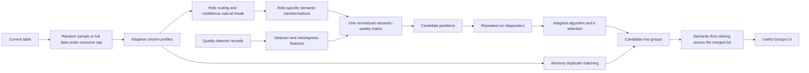

# Profiler-Guided Semantic-Quality Clustering Methodology

## 1. Research question

The implementation tests this system-design hypothesis:

> Column roles inferred by an explainable profiler can improve the semantic
> usefulness, stability, and explainability of row-group discovery in
> heterogeneous tables.

Buckaroo clusters **rows**, not columns. The profiler determines which columns
are safe and which transformation fits each role. The transformed semantic
blocks and quality evidence are concatenated into one row representation before
clustering. Quality therefore helps shape a semantic cohort without producing
context-free, quality-only clusters.

## 2. Production flow



**Update (2026-07-20):** clustered and near-duplicate groups are no longer two
separate result families with two separate UI categories. Every candidate group
— clustered or exact-match — now flows into one merged list and is ranked by
the same semantic-first policy (Section 8). The `view` field (`semantic_quality`
vs `duplicates`) is retained on every group for provenance and shown as a small
badge in the UI, but it no longer determines a separate queue, a separate
section of the panel, or a separate ranking pass.

The API entry point is `GET /api/plots/semantic-groups` with
`strategy=semantic_quality`. The former `multi_view` value remains an API alias.
The orchestration function is
`generate_multiview_grouping_json()` in
`app/server_utils/multi_view_grouping.py`.

## 3. Sampling

- Default evidence: all rows when the dataset contains at most 10,000 rows.
- Larger files: a repeatable random sample of at most 10,000 rows.
- Method: hash-based random ordering without replacement.
- Seed: `20260717`.
- Controlled experiments may explicitly override sample size.

The route, generic client, and active modal no longer inject 5,000-, 3,000-, or
eight-row semantic defaults. The 10,000-row value is explicitly classified as
an interactive resource budget, not a statistically optimal sample size. A
future progressive version can stop earlier from stability evidence.

## 4. Profiler contract and feature routing

For every non-helper column, Buckaroo consumes:

- selected profile role and broad role family;
- profile confidence;
- ambiguity and warning evidence; and
- any saved user role override.

The confidence gate is not a fixed probability. Buckaroo applies a
maximum-between-class-variance split to the confidence scores observed in the
current dataset. Scores in the stronger observed class enter semantic blocks.
The response records the effective cutoff and its source.

Hard semantic safeguards remain:

- identifiers, primary keys, and quasi-identifiers do not enter semantic
  distance;
- vector blobs do not enter ordinary text distance;
- high-uniqueness timestamps enter lifecycle features, not duplicate keys; and
- geographic roles enter the geography view rather than becoming identifiers
  solely from uniqueness.

These are role constraints, not numeric thresholds.

Routing is mutually exclusive. Each approved semantic column enters exactly one
semantic preprocessing block. Quality evidence is a separate evidence dimension
and may refer to the same source column, but the semantic value itself is never
duplicated across semantic blocks. Ordinary categorical fields remain
categorical even when their names contain words such as `status`; Buckaroo does
not use a dataset- or industry-specific lifecycle vocabulary.

**Update (2026-07-21) — profiler confidence reliability made column-aware, not
sample-size-only.** `score_profile_confidence()`'s reliability term was
`min()`'d against a dataset-wide worst-case bound (an assumed 50/50 split
derived from sample size alone via `evidence_interval(n // 2, n, ...)`) —
identical for every column at a given sample size, regardless of how clean
that specific column's own distribution is. A genuinely column-aware
computation already existed (`reliability_from_margin()` applied to that
column's own evidence interval — cardinality for categorical columns,
numeric-parse for measures) but was needlessly clamped down to the
dataset-wide floor. Fixed by using the column-aware value directly, in both
the chosen-role scoring function and its twin for displayed alternative
candidates. Measured directly on real data: every previously-capped
categorical column on the live StackOverflow table rose (e.g. `YearsCoding`
0.821 → 0.850, `RaceEthnicity` 0.926 → 0.969). Because the adaptive
confidence cutoff (above) is itself a natural-break split over the current
distribution, raising most columns' scores shifted the cutoff upward too —
which dropped `Country` (see Section 5.4) out of the geography view as a
side effect, fixed by extending the same "clears its own stronger,
column-specific gate" exemption pattern already used for ordinal columns
(Section 5.1) to geography-eligible columns. See
`ADAPTIVE_DECISION_POLICY.md`'s "Profiler-confidence reliability" section
for the full trace, including a test-authoring bug (a monkeypatch that
silently never took effect, since Python binds default arguments at
function-definition time) caught and fixed along the way.

## 5. Preprocessing blocks in the combined representation

These blocks use different transformations because a date, coordinate, category,
and paragraph do not have the same mathematical meaning. They are not clustered
separately. Buckaroo removes non-varying dimensions, row-L2 normalizes every
active block, concatenates the blocks, and row-L2 normalizes the final matrix.
This prevents a block from dominating merely because it contains more generated
features. No manually tuned block weights are used.

"One combined matrix" does **not** mean one TF-IDF document or one collapsed
dataset vector. If the sample has `n` rows, every block has `n` rows and the
final matrix still has `n` rows. Buckaroo joins feature columns horizontally:

```text
row i = [numeric features | categorical/text features | time features |
         geographic features | generic fallback features | quality features]
```

Original row `i` therefore remains vector `i`. Only symbolic/text blocks use
TF-IDF. Numeric, temporal, and geographic values retain their appropriate
geometry. Column-qualified tokens such as `country__india` also preserve source
field identity.

### 5.1 Business segments

Inputs are profiler-approved numeric measures and categorical fields.

Numeric representation:

1. parse values as numeric;
2. require at least two distinct parsed values;
3. center by median and divide by IQR;
4. fall back to standard deviation when IQR is zero;
5. derive a clipping bound from the observed standardized tail; and
6. weight the feature by its profile confidence.

Categorical values become column-qualified tokens such as
`country__india`. This keeps the same word in two columns from becoming the same
feature accidentally.

**SBERT categorical embeddings (2026-07-21) — replaces token equality for
open-vocabulary columns, on by default.** Exact-match tokens treat "Back-end
developer" and "Front-end developer" as unrelated as "Back-end developer" and
"France" — identical strings match, everything else is equally "different".
For genuinely open-vocabulary categorical fields (job titles, unstructured
business categories) that model is wrong, so those columns are now embedded
with `sentence-transformers` (`all-MiniLM-L6-v2`, 384-dim, L2-normalized) in
`app/server_utils/semantic_embeddings.py` instead of tokenized. Each *unique*
value is embedded once (cached, not once per row) and weighted by profile
confidence like every other feature.

Which columns qualify is decided by two dataset-derived gates, neither a
hardcoded number, in `embedding_eligible_columns()`:

1. **Role gate.** Only `categorical`-role columns. Binary/coded categories
   (`Male`/`Female`, small enumerated codes) stay on exact match — equality is
   already the correct model there, and embedding them adds noise, not signal.
2. **Cardinality gate.** Among role-eligible candidates, `natural_break_threshold`
   (the same Otsu-style 1D split used for confidence and every other adaptive
   cutoff in this codebase) finds where candidate columns separate into a
   higher-cardinality and lower-cardinality class; only the higher class is
   promoted. Requires at least 3 role-eligible candidates, or nothing is
   promoted — the conservative default used everywhere else in this project.

This activates via `strategy=semantic_quality` — the default — so it is a
no-op (falls back to exact-match tokens) on any dataset without open-vocabulary
categorical columns that clear both gates; it is not a separate opt-in
strategy value. See `docs/clustering/RANKING_AND_SIMILARITY_POSITION.md` §2.3
for the full reasoning, including why this does not repeat the per-dataset
overfitting mistakes already caught and fixed elsewhere in this project.

**Ordinal (bucketed-range) distance (2026-07-21) — takes priority over both
token equality and embeddings, on by default, no external data.** Categorical
columns that are actually bucketed numeric ranges ("18-24 years old", "0-2
years") were still being treated as pure equality even after the embedding
fix above — "18-24" is no closer to "25-34" than to "65+" under exact-match
*or* embedding similarity. `ordinal_eligible_columns()` in
`multi_view_grouping.py` parses each distinct value with
`parse_ordinal_bucket_value()` (a range's midpoint, or a one-sided bound's
stated value) and requires strict range/comparison structure to match at all
— a bare number with no separator or bound word ("Country 14") does not
parse, which matters: an earlier, looser version of the parser accepted any
string containing a digit and had to be tightened after it mistakenly
flagged high-cardinality ID-like columns as ordinal. Eligible columns are
converted to their parsed number and routed through the same numeric
distance machinery §5.1 already uses for measures — no new distance code.
Because this reads real order directly out of the values, it needed no
external reference data, unlike the geography fix below. It does not cover
purely verbal orderings ("Some college" < "Bachelor's" < "Master's") — see
`RANKING_AND_SIMILARITY_POSITION.md` §2.3 for why that remains an open,
documented gap rather than a hand-coded word-order list.

A column that independently clears this ordinal gate is also exempted from
the general profiler-confidence cutoff that otherwise excludes it from
clustering entirely (`choose_view_columns()`) — found live when two
genuinely clean bucketed columns (`YearsCoding`, `HoursComputer`) sat just
under the cutoff for reasons unrelated to their own data quality (no
profiler name-hint keyword match). This is a narrow, per-column exemption,
not a general relaxation of the cutoff — see
`ADAPTIVE_DECISION_POLICY.md`'s "Ordinal columns bypass the general
confidence cutoff" section for why the shared confidence formula itself was
deliberately left untouched.

### 5.2 Text themes

Only fields profiled as free text enter this block. The default production
representation is column-aware TF-IDF. TF-IDF creates the feature matrix; it
is not itself a clustering algorithm.

Each text column receives a token limit derived from the robust upper fence of
its observed token-count distribution. A 512-token safety ceiling protects
memory from pathological cells.

**Free-text SBERT embeddings (2026-07-21) — opt-in, replaces TF-IDF for
eligible columns.** Extends §5.1's embedding path to genuine prose (e.g.
`Consumer complaint narrative`), reusing the same embedding machinery. Two
differences from the categorical case, both deliberate: eligibility is a
plain role gate (`free_text` role only, no cardinality split — prose is
high-cardinality by construction, so a cardinality split carries no signal
the way it does for categorical columns), and this stays behind its own flag
(`strategy=semantic_quality_free_text_embeddings`) rather than shipping to
the default path, since TF-IDF already does real work on free text (unlike
exact-match tokens on open-vocabulary categories, which were never a good
model) — this representation swap earns its own scrutiny before becoming
default. Verified against the real model on real prose, not just single
words: three differently-worded "nobody called me back" complaints scored
0.86 in-group cohesion vs 0.72 baseline.

### 5.3 Lifecycle groups

Inputs are profiler-approved datetime roles. Categorical process statuses remain
column-aware categorical evidence in the business block. This removes a former
name-based status rule and allows unseen domains to use the same routing policy.

Datetime features include:

- robust-scaled absolute time;
- cyclical month, weekday, and hour coordinates;
- missingness indicators; and
- event-to-event durations.

Buckaroo considers every valid datetime pair. Pair evidence is
`coverage * log(1 + distinct duration count)`. A natural break selects the
stronger evidence class, and a `ceil(sqrt(sample rows))` complexity budget
prevents feature explosion.

### 5.4 Geographic groups

Profiler geography roles control this view. Every latitude/longitude pair is
matched by column-name context, so tables containing origin and destination
coordinates are supported. Coordinates become three unit-sphere features to
handle longitude wraparound.

**Geography reference table for location names (2026-07-21) — countries
only, on by default, no per-dataset tuning.** Location *names* without
paired coordinates ("Country=India") previously fell back to exact-match
categorical tokens like any other category — "India" was mathematically no
closer to "Pakistan" than to "Australia". `app/server_utils/
geography_reference.py` resolves a country name to its capital city's
coordinates via two small, static, offline libraries (`pycountry` for
name/alias resolution, `geonamescache` for the coordinate data — no network
calls at request time), feeding the result into the exact same
spherical-projection code this section already uses for explicit
coordinate columns, via a shared `project_lat_lon_to_unit_sphere()` helper.
City-level matching was deliberately out of scope for this pass: city names
collide across countries ("Springfield", "San Jose") in a way country names
essentially don't. Built as its own scoped decision on 2026-07-25 (see
`ADAPTIVE_DECISION_POLICY.md`'s "City-level geography matching" section):
`city_centroid()` disambiguates context-first (a companion country/region
value for the same row narrows the match) and population-based only as a
last resort when no such context exists or the hint doesn't match any
candidate — not population-only, since population alone would pick the same
"Springfield" for every row regardless of which one the row actually meant.

Before building this, tested empirically whether SBERT (§5.1's mechanism)
could substitute for a reference table — it cannot: embedding real country
names showed France scoring *closer* to Australia (~16,700 km away) than to
Japan (~9,700 km away), and the UK scoring closer to Australia than to
Poland (~1,500 km away). SBERT tracks linguistic/cultural co-occurrence, not
physical distance — confirming geography specifically needs an exact,
looked-up ground truth, unlike arbitrary nominal categories where no such
ground truth exists. See `RANKING_AND_SIMILARITY_POSITION.md` §2.3 for the
full reasoning and the `pycountry`/`geonamescache` naming-divergence bug
found and fixed along the way (ISO renamed Turkey to "Türkiye";
`geonamescache`, and every real dataset, still say "Turkey").

Location names/codes that are *not* eligible (fail the resolution gate, or
are city/region-level) still fall back to column-qualified categorical
tokens, exactly as before this change.

**Update (2026-07-20) — geography description evidence fixed to a comparable
scale.** The geography *description* candidate (Section 9) originally scored
itself as a raw great-circle angle in radians, while every other family scores
itself as an IQR-normalized effect size (how far the group's value sits from
the full sample's, relative to how spread out the sample already is). Mixing a
raw geometric quantity with normalized effect sizes meant a genuine geographic
split could score as artificially weak and lose to unrelated fields in the
natural-break evidence cutoff — a bug independent of any specific dataset,
caught while stress-testing description generalization. The fix scores a
group's geographic offset relative to the spread of the *full sample's*
distances from that same baseline center, the same "offset over typical
variation" pattern used everywhere else. The description phrase itself was
also changed from raw decimal coordinates (`"coordinates centered near 40.71,
-74.00"`, unreadable to most people) to a plain-language compass direction and
distance (`"a location about 1,940 km east-northeast of the sample's typical
center"`), falling back to `"a location near the sample's typical center"` when
the offset is under 1 km (short distances make compass direction noisy).

### 5.5 Open-world generic fallback

Any safe, confident profiler role that Buckaroo does not recognize enters the
generic block instead of disappearing. The fallback inspects the current
column's observed values and chooses numeric, temporal, or symbolic
preprocessing. It does not look for dataset names, business topics, or a fixed
list of fields. The response records both the generic block assignment and its
observed-value fallback role.

This fallback supports new scientific, sensor, legal, educational, and other
domains without adding a new rule for each dataset. It is a robustness
mechanism, not evidence that every future semantic role will be perfectly
understood.

### 5.6 Quality evidence

Detector findings become column-qualified features such as
`quality__missing__licence_number`. Buckaroo also derives missingness indicators,
a robust-scaled count of quality signals, and a has-signal indicator. Identifier
columns are excluded from this block as well as the semantic blocks. The quality
block joins the semantic blocks before clustering; it never creates a standalone
quality-only result family. When no quality signal varies, the block is inactive
and semantic clustering continues normally.

### 5.7 Near-duplicate groups

Identifiers and raw high-uniqueness timestamps are excluded. Text/category
values are normalized. Numeric tolerance uses the Freedman-Diaconis width in
robust-standardized units. Required non-missing evidence comes from a natural
break in observed row completeness. These groups are advisory and never justify
automatic deletion.

**Update (2026-07-20) — descriptions name values, not just fields.** The
description generator originally named only the columns that matched exactly
(e.g. "Rows matching on all 3 compared fields: Gender, Continent, and
Country"), which produced an identical headline for every near-duplicate group
in a dataset whose duplicate signatures happened to share the same columns.
Live testing caught this: the field names were real, but the values that
actually distinguish one group from another were missing. Each exactly-matching
column now becomes a candidate carrying both the friendly column name and the
shared value (`"{friendly_column} is {value}"`), so the headline reads
`"Rows where Gender is Male, Continent is AS, and Country is Israel"` — capped
at four named field/value pairs, with any remainder summarized as `"N more
matching fields"` rather than silently dropped. Every match still appears in
the group's supporting-fields list regardless of the headline cap. This uses no
dataset-specific vocabulary: it names whatever values are actually present.

## 6. Adaptive algorithm and cluster-count selection

The implementation no longer says that one data type always receives one
algorithm. It builds the combined matrix once, then:

1. **deduplicates the matrix to its distinct rows** (2026-07-21 — see below);
2. constructs candidate `k` values from sample size, unique feature rows, and
   data-derived minimum group support;
3. runs deterministic K-means with seeds 42 and 137 for every candidate `k`;
4. measures partition stability, coherence, distinctiveness, size balance, and
   assigned-row fraction;
5. selects a competitive K-means candidate using natural score separation;
6. compares it with agglomerative clustering when the estimated pairwise
   matrix fits a 256 MiB resource budget;
7. compares adaptive DBSCAN when a k-distance knee yields at least two
   non-noise groups; and
8. uses the top algorithm only when it is naturally separated from the
   runner-up, otherwise retaining the simpler deterministic K-means result;
9. expands the resulting labels back to one entry per original row.

Two algorithm candidates alone are treated as ambiguous: an arbitrary midpoint
between two unequal scores is not accepted as evidence of two score classes.

**Deduplicate before clustering, not after (2026-07-21).** Every decision in
steps 2–8 above is now made on the matrix's *distinct* rows
(`run_internal_clustering`/`adaptive_dbscan_record`), not the full
row-multiplicity matrix. Found live: a numerically-dominant near-duplicate-
dense majority can distort distinctiveness/balance enough to bury a smaller,
genuinely separate cluster before it ever becomes a candidate, and skews
DBSCAN's automatic epsilon selection toward an artificially tiny value
(duplicate rows contribute zero-distance neighbor pairs) — confirmed
directly, 46 over-fragmented clusters on a test dataset K-means correctly
merges into 2 once deduplicated. Unconditional, not gated by a
duplication-density threshold: a dataset with no duplicate rows sees no
behavior change at all, since every row is already unique. See
`ADAPTIVE_DECISION_POLICY.md`'s "Near-duplicate crowd-out risk" section for
the full investigation, including the honest, tested limits of what this
fix does and does not resolve.

Duplicate signatures are not forced through K-means because duplicate matching
is an advisory identity check, not a second semantic clustering problem.

### 6.1 Candidate K range

```text
2 .. min(unique feature rows,
         rows / data-derived minimum support,
         ceil(log2(unique feature rows)))
```

This replaces the former fixed ceiling of eight clusters.

### 6.2 DBSCAN radius

DBSCAN's `eps` is the knee of the sorted k-neighbor distance curve. The former
70th-percentile rule and fixed `[0.05, 0.55]` clipping bounds are gone.

### 6.3 Stability perturbation

The perturbation magnitude is the median positive nearest-neighbor distance
divided by the square root of feature count. This replaces a universal
`1e-4` perturbation.

## 7. Partition diagnostics

For every approximate candidate, Buckaroo records:

- **stability:** matched row overlap under a second run;
- **coherence:** mean similarity to the group centroid;
- **distinctiveness:** the *upper quantile* (not mean, since 2026-07-21 —
  see below) of each cluster's separation from its nearest other centroid;
- **balance:** normalized entropy of group sizes; and
- **assigned fraction:** rows assigned to non-noise groups.

The candidate score is their geometric mean. The geometric mean prevents a
candidate with one near-zero property from hiding that failure behind high
values elsewhere. These are benchmark-free internal diagnostics, not semantic
ground truth.

**Distinctiveness: upper quantile instead of mean (2026-07-21).** The mean
version diluted a genuinely well-separated minority cluster's contribution
by averaging it with every other, less-separated cluster in the same
partition — on data with a large duplicate-dense majority, raising `k`
mostly subdivides that majority into more near-identical fragments, which
drags the *mean* down almost regardless of whether a real minority cluster
is also present. The upper quantile instead rewards a partition that
contains *at least one* well-separated cluster, while still correctly
penalizing meaningless over-segmentation of an ordinary dataset (spurious
splits of one real cluster are all mutually close, including the "best"
one, so the quantile stays low there too). Verified zero regressions across
the full suite and the threshold audit script.

**Known, demonstrated flaw in `balance`, investigated but not fixed
(2026-07-21).** Direct counter-example: `balance([336, 40, 40, 40])` — the
*correct* answer for one large majority plus three genuine minority
clusters — scores 0.624, while `balance([228, 228])` — that same population
wrongly merged in half — scores 1.000. The metric assumes clusters "should"
be evenly sized, which is an assumption about shape, not something the data
determines. A principled replacement (fraction of clusters meeting a
usable-size floor, instead of size-evenness) was tested and found not to
help: it doesn't change the selected `k` on real StackOverflow data, only
narrows (not closes) the gap on the adversarial case that motivated it, and
risks becoming vacuous (constant 1.0) at exactly the floor loose enough not
to over-penalize genuine minority clusters — silently discarding the real
degeneracy protection `balance` does provide elsewhere. Not shipped. See
`ADAPTIVE_DECISION_POLICY.md`'s "Second follow-up" for the full trace,
including why `stability`'s bias toward low `k` was checked and found
legitimate rather than buggy (a simpler partition genuinely is more
reproducible), and why chasing a fix further here would mean re-tuning
three shared formulas against one synthetic case — the per-case overfitting
this project has repeatedly guarded against elsewhere. This is recorded as
an open, named limitation for the benchmark work (§12) to settle, not an
unsolved bug awaiting a quick fix.

## 8. Group ranking and acceptance

### 8.0 Quality-signal gate (2026-07-20) — a hard filter, before everything else

Buckaroo is a **data-quality** tool. A cluster that is semantically coherent but
carries no *enriched* data-quality issue — its quality pattern is the
"no unusual concentration of data-quality issues in this group" fallback — is
**dropped entirely** before ranking or acceptance, not merely ranked lower.
This is a deliberate policy decision made on 2026-07-20 in direct response to
the advisor's question, "if you don't have data-quality issues, then why would
you need that cluster?": for *this* tool, you would not.

Mechanism: every candidate group records `hasQualitySignal` (true only when it
has a quality field whose in-group incidence is genuinely enriched over the full
sample, per the same enrichment test in Section 9). Groups with
`hasQualitySignal == false` are filtered out of the candidate list before
`select_useful_candidates` runs. The response reports `qualitySignalRequired:
true` and `groupsDroppedWithoutQualitySignal: N` under `adaptivePolicy` so the
filter is transparent, not silent.

Consequences, stated honestly:

- On a dataset with **no detected quality issues anywhere**, zero groups are
  returned, and the UI shows its empty state. This is intended: a data-quality
  tool surfacing error-free clusters would be noise.
- This **supersedes** the earlier "the analyst signal scores 0 but never
  disqualifies" framing (Section 8.3) *for the specific case of a totally
  absent quality signal.* The analyst signal still never disqualifies a group
  *within the ranking*; the disqualification is now a separate, earlier, hard
  gate. The two mechanisms are distinct and both apply: the gate decides
  whether a group is shown at all; the analyst signal decides how a shown group
  ranks.

### 8.1 Acceptance (unchanged)

Each group carries stability, coherence, distinctiveness, explanation evidence,
source profile confidence, and nontrivial coverage. Buckaroo:

1. converts every component to an empirical percentile;
2. takes the median component percentile without fixed weights;
3. derives utility and stability cutoffs from natural breaks;
4. removes coverage outliers using a robust upper fence;
5. keeps the best candidate when a view would otherwise disappear completely;
6. derives overlap suppression from observed Jaccard values.

A group covering every sampled row is structurally rejected because it does not
partition the dataset. There is no 85% dominance rule, 0.45 stability rule,
0.52 utility rule, 0.92 overlap rule, fixed utility weight vector, or
three-groups-per-view quota in the active implementation. This stage produces
`utilityScore` (see `ADAPTIVE_DECISION_POLICY.md`) — a percentile blend of
cluster geometry (stability, coherence, distinctiveness, explainability,
profile confidence, coverage balance) with no dominant component.

### 8.2 Final ranking — semantic-first (2026-07-20)

`utilityScore` alone used to be the final sort key, applied separately within
each result family (clustered groups round-robined against near-duplicate
groups so neither queue could fill the whole panel). Live testing raised a
direct challenge to this: near-duplicate and semantic-quality groups
shouldn't be separate categories at all, and semantic meaningfulness should
dominate the ranking rather than sit as one equal component among several.
Both changes were made explicitly, not defaulted into, and both are a knowing
departure from the "no dominant signal" position stated in Section 8.1 above —
recorded here rather than left for the docs and the code to quietly disagree.

Clustered and near-duplicate candidates are now merged into one list before
ranking. A new `semanticScore` is computed per group as a percentile blend
(median, not a weighted sum) of four components, each ranked across the full
merged candidate list:

- **specificity** — the mean of the group's top two non-quality supporting-field
  strengths (the same numbers that drive the description sentence);
- **analyst signal** — see Section 8.3;
- **distinctiveness** and **explainability** — carried over from `utilityScore`.

The final sort key is the tuple `(semanticScore, utilityScore)`: `semanticScore`
decides the order first, and the old `utilityScore` only breaks ties between
groups that are equally meaningful. This is a **lexicographic priority, not a
hand-tuned weight** — nothing inside `semanticScore` or `utilityScore` uses a
fixed numeric weight, so the "no arbitrary weights" position is preserved
*within* each score; the exception is which family of evidence goes first
between the two scores, and that exception is stated here on purpose.

Provenance is not lost: every group still records its originating `view`
(`semantic_quality` or `duplicates`), shown as a small badge on the group card,
and near-duplicate groups are still generated by exact-match signatures, not by
clustering — only the user-facing categorization and the ranking pass were
merged.

**Open risk, not yet tested:** on a dataset with much higher duplicate density
than the ones used so far, near-duplicate groups — which are always at maximum
specificity (an exact match scores `strength = 1.0`) — could plausibly crowd
out clustered semantic-quality groups near the top of the merged list. This has
not been observed, but it has also not been checked against a
duplicate-dense dataset, and is flagged as a next step rather than assumed
away.

### 8.3 Analyst signal — meaning and a real issue, combined

A separate discussion pushed back on what "useful" should mean for ranking:
not "has errors," and not "is semantically clean" alone, but the combination —
a coherent, nameable segment that *also* carries a real quality issue, the
kind of finding a data analyst would call actionable. `analyst_signal_strength`
implements this as a geometric mean:

```text
semantic  = mean(top 2 non-quality supporting-field strengths)
quality   = max(strength for quality fields where enriched is true)
signal    = sqrt(semantic * quality)
```

The geometric mean means a group needs *both* halves to score above zero here:
a semantically clean group with no quality issue scores exactly 0 on this axis,
a group with an unenriched or absent quality signal also scores 0, and a
coherent segment with a genuinely enriched issue on top of it is the only case
that scores positively. (Note: as of 2026-07-20 a group with a *completely
absent* quality signal is removed by the hard gate in Section 8.0 before it
ever reaches this ranking, so in practice the analyst signal now differentiates
among groups that all already have *some* enriched quality issue; the
"scores 0, not penalized elsewhere" behavior still applies to the
unenriched/weak cases that survive the gate.) This mirrors the geometric-mean
choice already used for partition diagnostics (Section 7): no single weak
dimension can hide behind a strong one. All four qualitative cases — combined,
semantic-only, issue-present-not-enriched, issue-present-no-story — were
verified directly against the function before being trusted in the ranking
pipeline, and are locked in as a permanent regression test.

## 9. Explanations and UI metadata

Each returned group includes:

- a data-grounded semantic cohort and a separately stated quality pattern;
- ranked supporting fields with group-versus-sample evidence;
- representative sampled rows nearest to the cluster centroid;
- boundary rows farthest from the centroid, labeled as boundary cases rather
  than errors or known misclassifications;
- rows and sample coverage;
- semantic score (primary rank), utility score (tie-break), stability, coherence,
  distinctiveness, and profile confidence;
- quality context without requiring the group to be error-only;
- internal method and algorithm diagnostics;
- caveats and truncated-row-ID metadata; and
- a `Select rows` action.

**Update (2026-07-20):** the UI's separate "Semantic-quality groups" /
"Near-duplicate groups" filter tabs are removed. The panel now shows one
merged, ranked list; each card still carries a small view-provenance badge.
The headline metric shown on each card changed from "Evidence rank"
(`utilityScore`) to "Semantic rank" (`semanticScore`), matching the ranking
change in Section 8.2.

The top-level `adaptivePolicy` object reports effective support, confidence
cutoff, acceptance rules, overlap cutoff, sample/resource metadata, and
`humanLabelsUsed: false`. The combined representation reports its active blocks,
feature dimensions, routed semantic and quality columns, quality-signal rate,
and normalization rule. The clustering run reports candidate K values,
algorithm candidates, score separation, and the final selection reason.

Description evidence is ranked from the current sample. Numeric and temporal
fields use robust group-versus-sample location differences; categorical values
use concentration above their sample prevalence; symbolic terms use positive
cluster-versus-sample TF-IDF prominence; coordinates use an offset-over-spread
effect size with a plain-language compass phrase (Section 5.4); near-duplicate
fields use the matched field name and its shared value (Section 5.7); and
quality phrases compare detector incidence in the group with the full sample.
Natural score separation selects the stronger observed evidence class. Display
caps limit payload and visual length; they do not decide cluster membership.

**Update (2026-07-21) — SBERT-embedded columns get a meaning-based
description, not just an exact-match one.** The concentration-based
categorical description (previous paragraph) can only reward one dominant
*repeated* value; it goes silent exactly when a group is held together by
several *different* but semantically close values — which is precisely the
case §5.1's SBERT embeddings exist to catch (e.g. "Back-end developer" /
"Front-end developer" / "Full-stack developer"). `build_view_matrix` set
`embeddingColumns`/`embeddingValuesByColumn` on its per-block feature info,
but `build_semantic_quality_matrix`'s block-merge step dropped both keys
before they reached the description phase, so a group's headline stayed
"job title usually Back-end developer (33% here vs 12% baseline)" even when
the real reason the group held together was semantic, not frequency. Fixed by
(1) propagating `embeddingColumns`/`embeddingValuesByColumn` through the
merge, and (2) a new `embedding_semantic_description_candidate()` that fires
for embedding-routed columns with 2+ distinct present values, scored the same
way every other candidate is — group cohesion (mean cosine similarity of the
group's distinct values to their centroid) minus the column's baseline
cohesion (same measure over the full sample's vocabulary), not a hardcoded
similarity cutoff. Verified live against the real model: a synthetic
Back-end/Front-end/Full-stack developer group now reads "job title values
that mean the same thing, such as Back-end developer, Front-end developer,
and Full-stack developer" with group cohesion 0.91 vs baseline 0.72. A
single-distinct-value group still falls through to the exact-match
candidate, since that case genuinely is an equality story, not a semantic one.

**Update (2026-07-20) — no internal jargon in fallback text.** When no field
distinguishes a group at all, the semantic-cohort fallback previously read
"Rows sharing a similar profiler-approved semantic pattern" — internal
implementation vocabulary (`profiler-approved`) leaking directly into a
user-facing headline. It now reads "Rows placed together without any single
field standing out from the rest of the sample." Similarly, when no quality
field is genuinely enriched, the quality-pattern fallback no longer reuses the
literal generic phrase this project had already rejected once
("no recurring detected quality issue that distinguishes this group"); it now
reads "no unusual concentration of data-quality issues in this group," and the
uninformative clause is dropped from the concatenated one-sentence
`description` field entirely rather than padded on with "with ...".

**Update (2026-07-21) — ordinal and geography-name columns each get their
own grounded description, reusing existing scoring patterns rather than
inventing new ones.** `ordinal_description_candidate()` scores exactly like
the numeric candidate (§9, third paragraph) but displays the group's
position via the *original bucket label* looked up from the data
("typically 9-11 years") instead of a raw parsed number ("typically 10.5"),
so it reads naturally. `geography_name_description_candidate()` reuses the
same angle/spread effect-size scoring and compass phrasing the coordinate
candidate already uses (§5.4), sourcing coordinates from the reference-table
lookup instead of raw lat/long columns — verified live on real StackOverflow
data: `"Country typically a location about 607 km north-northwest of the
sample's typical center"` with `groupValue: "Spain"`, alongside the
pre-existing `Continent: EU` categorical evidence independently telling the
same story. Both take priority over the generic role/family branches for
any column that clears their respective eligibility gate — a column already
proven to have a stronger, more specific evidence story available should
never fall back to less-informative treatment.

**Update (2026-07-21) — embedding-routed prose columns summarize instead of
quoting, on direct instruction after the un-summarized version shipped.**
`embedding_semantic_description_candidate()` (above) originally quoted up to
3 full distinct values in every headline — fine for a single categorical
word, but free-text sentences produced 250+ character headlines. For values
averaging more than 6 words (a formatting cutoff, not a modeling threshold —
same category as the description-length caps elsewhere in this section),
`shared_embedding_terms()` now replaces quoting with a deterministic keyword
summary: tokens that recur across 2+ of the group's own distinct values,
ranked by recurrence — not a generated summary, no fabrication, the same
"only report what is literally present" discipline every candidate in this
section follows. Caught and fixed along the way: the existing stop-word list
(tuned for short category tokens — 20 words, no pronouns or prepositions)
let words like "about"/"my" dominate real prose ahead of actual content
words; a separate ~70-word prose-specific stop-word set fixed this without
touching the original list or any other tokenization path. Verified against
the real model: a "nobody called back" example went from a ~250-character
headline quoting all three sentences to `"3 narrative entries with similar
meaning (shared language: balance, calls, loan)"` — 81 characters, every
word a real recurring word from the group's own text. Short label-like
values are unaffected — still quoted exactly as before.

## 10. Verification completed

Automated tests verify:

- natural thresholds separate observed low/high score classes;
- group support changes with category-frequency distributions;
- explicit overrides remain available for controlled experiments;
- K candidates can scale beyond the former ceiling of eight;
- stability is invariant to arbitrary cluster label numbers;
- unstable partitions score below stable partitions;
- candidate separation distinguishes a clear winner from a tied top class;
- semantic clustering works without detector errors;
- quality signals enter the same matrix instead of creating quality-only groups;
- identifiers are excluded from semantic and quality distance; and
- low-confidence semantic features are excluded; and
- every semantic column is routed to exactly one semantic block;
- unfamiliar profiler roles survive through the value-driven generic fallback;
- descriptions contain structured supporting evidence and in-group examples;
- the source-backed threshold audit resolves every current decision;
- near-duplicate descriptions name the actual matched field values, so two
  different duplicate groups never produce the same sentence (2026-07-20);
- the analyst signal scores positively only when a group has both a coherent
  semantic story and a genuinely enriched quality issue, and scores exactly
  zero — never negative, never disqualifying — for all three other cases
  (2026-07-20);
- fallback text for "no standout field" and "no quality signal" contains no
  internal implementation vocabulary (2026-07-20);
- geography description evidence scores on the same effect-size scale as every
  other field family (2026-07-20);
- groups with zero enriched quality signal are dropped entirely, not merely
  deprioritized (2026-07-20);
- SBERT categorical embeddings stay gate-limited (role + adaptive cardinality)
  and never change the representation for role-ineligible or low-cardinality
  columns (2026-07-21);
- `build_semantic_quality_matrix`'s block-merge step propagates embedding
  metadata (`embeddingColumns`, `embeddingValuesByColumn`) to the description
  phase instead of silently dropping it (2026-07-21);
- embedding-routed columns with 2+ distinct present values produce a
  meaning-based description candidate, scored as group cohesion above the
  column's baseline cohesion, and a single-distinct-value group still falls
  through to the exact-match candidate instead (2026-07-21);
- free-text embeddings stay behind their own opt-in flag, independent of the
  always-on categorical flag — requesting one never activates the other
  (2026-07-21);
- embedding-routed prose columns summarize shared recurring words instead of
  quoting full sentences, while short label-like values still quote exactly
  as before (2026-07-21);
- `parse_ordinal_bucket_value()` requires genuine range/comparison structure
  and rejects bare numbers with none (`"Country 14"` does not parse), and
  `ordinal_eligible_columns()` requires every distinct value to parse plus at
  least one repeated value, so a fully-unique ID-like column is never
  mistaken for a bucketed scale (2026-07-21);
- a column that clears the ordinal gate bypasses the general profiler-
  confidence cutoff for ordinal purposes specifically, while a low-confidence
  column that is *not* ordinal-eligible is still excluded normally (2026-07-21);
- `geography_name_eligible_columns()` requires every distinct value to
  resolve to a country, and the block-merge step propagates
  `geographyNameColumns`/`geographyCentroidsByColumn` to the description
  phase the same way embedding metadata is propagated (2026-07-21);
- clustering decisions (k-selection, DBSCAN epsilon) are made on the
  matrix's distinct rows and labels are correctly expanded back to one entry
  per original row, including every row in an exact-duplicate group sharing
  a single label (2026-07-21); and
- distinctiveness's upper-quantile aggregation does not change results on
  data with no duplicate rows, and the `run_internal_clustering`/
  `adaptive_dbscan_record` deduplication is a verified no-op wherever no
  duplication exists (2026-07-21);
- a column's profiler-confidence reliability reflects its own evidence
  interval and genuinely exceeds the old dataset-wide worst-case floor for a
  clean column, rather than being capped down to it (2026-07-21); and
- a column that clears `geography_name_eligible_columns()`'s own gate
  bypasses the general confidence cutoff for geography purposes
  specifically, verified with a real dependency-injection test (fictional
  country names a real resolver could never resolve) after an initial
  monkeypatch-based test was found to silently never take effect
  (2026-07-21); and
- `city_centroid()` disambiguates a colliding city name context-first (a
  companion country/region column's value for that row) and falls back to
  the most populous candidate only when no such context exists or the hint
  matches nothing; `city_name_eligible_columns()` checks every row rather
  than every distinct value (unlike the country-level gate), since the same
  city string can legitimately resolve differently under different row
  context; verified against the real reference data, not just injected
  fakes — `Paris`+`France` resolves to real Paris while the same string
  `Paris`+`United States` resolves to Paris, Texas (2026-07-25).

The full clustering-related suite (10 test files, including
`test_semantic_embeddings.py` and `test_geography_reference.py`) is at
**88 of 88 passing** as of 2026-07-25, and the full backend unit suite is at
**269 of 269 passing**. The clustering threshold audit script (134 curated
decisions across 15 files) also passes.

Run:

```powershell
python -m pytest tests/unit/test_adaptive_grouping_policy.py `
  tests/unit/test_multi_view_grouping.py `
  tests/unit/test_clustering_threshold_audit.py `
  tests/unit/test_dataset_profile_shape.py `
  tests/unit/test_ucc_discovery.py `
  tests/unit/test_backend_fortification.py `
  tests/unit/test_experiment_methodology.py `
  tests/unit/test_semantic_quality_benchmark.py `
  tests/unit/test_semantic_embeddings.py `
  tests/unit/test_geography_reference.py -q
python experiments/audit_clustering_thresholds.py --check
```

## 11. What can be evaluated without human labels

No human input is needed to measure reproducibility, perturbation stability,
candidate separation, planted-group recovery, planted-error recovery, runtime,
memory, or sensitivity to resampling. Those tests establish that the mechanism
is adaptive and internally consistent.

## 12. What still requires human labels

Human review is needed to claim semantic correctness, description usefulness,
calibrated confidence, or superiority over another clustering method. For a
paper, freeze labels, hold out entire datasets, never feed held-out labels into
the policy, and report per-dataset results with uncertainty.

## 13. Limitations

1. A natural break can occur in noise; adaptation does not guarantee meaning.
2. Two repeated runs are cheaper than a full bootstrap but provide weaker
   stability evidence.
3. TF-IDF captures lexical overlap but not synonym-level meaning.
4. The 10,000-row and memory/token ceilings are engineering budgets that still
   need hardware benchmarks.
5. Equal block normalization is a defensible neutral baseline, not proof that
   every block should matter equally for human usefulness. The planned benchmark
   must compare it with learned or reliability-weighted alternatives.
6. Upstream profiler and detector components still contain separately audited
   thresholds. This refactor does not calibrate every upstream component.
7. The generic fallback preserves unfamiliar columns but cannot recover domain
   meaning that is absent from values and metadata. Human evaluation on held-out
   domains is still required before claiming universal semantic generalization.
8. Semantic-first ranking (Section 8.2) is a deliberate exception to this
   project's "no dominant signal" stance, made explicitly rather than
   discovered as a discrepancy later. **Update (2026-07-21):** now tested
   against duplicate-dense synthetic data, up to 77% duplication. The
   ranking-level risk this item originally named does not occur — `view_tier`
   is a hard, structural priority over score, not a probabilistic one, so a
   near-duplicate group can never displace a semantic-quality group. A
   different, narrower, clustering-*level* risk was found instead (a genuine
   minority cluster can fail to be discovered at all, not out-ranked) and is
   only partially closed — see limitation 11 below.
9. Ordinal (bucketed-range) distance (Section 5.1) covers numeric ranges
   parsed directly from the values, with no external reference data. It does
   not cover purely verbal orderings with no digits at all ("Some college" <
   "Bachelor's" < "Master's" < "PhD") — that would need an external
   education-level reference table, the same shape as the geography fix
   below, and remains an open, undecided scope extension.
10. The geography reference table (Section 5.4) covered countries only, at
    first. **Update (2026-07-25):** city-level matching (name collisions like
    "Springfield", "San Jose") is now built — context-first via a companion
    country/region column per row, population as a last resort only when no
    such context exists or doesn't match. Closed, not open.
11. Deduplicating before clustering (Section 6) measurably narrows, but does
    not always close, the gap that lets a small minority cluster be
    discovered on duplicate-dense data — confirmed the gap closes from 0.26
    to 0.013 on one adversarial synthetic case without fully flipping the
    final k-selection decision there. Follow-up testing at more realistic
    (30–75%) duplicate density found the actual risk narrower than originally
    framed: a *single* unusual cluster is robust at any density tested, and
    the harder case (several distinct minority clusters competing for a
    higher k at once) gave mixed results even with the fix applied. Two
    further candidate fixes (a `balance` replacement, a k-selection rule
    change) were tested directly and found not to help — see Section 7's
    "Known, demonstrated flaw in `balance`" for the full trace. This is
    recorded as an open, evidence-backed limitation for the benchmark (§12)
    to resolve, not a bug awaiting a quick follow-up fix.
